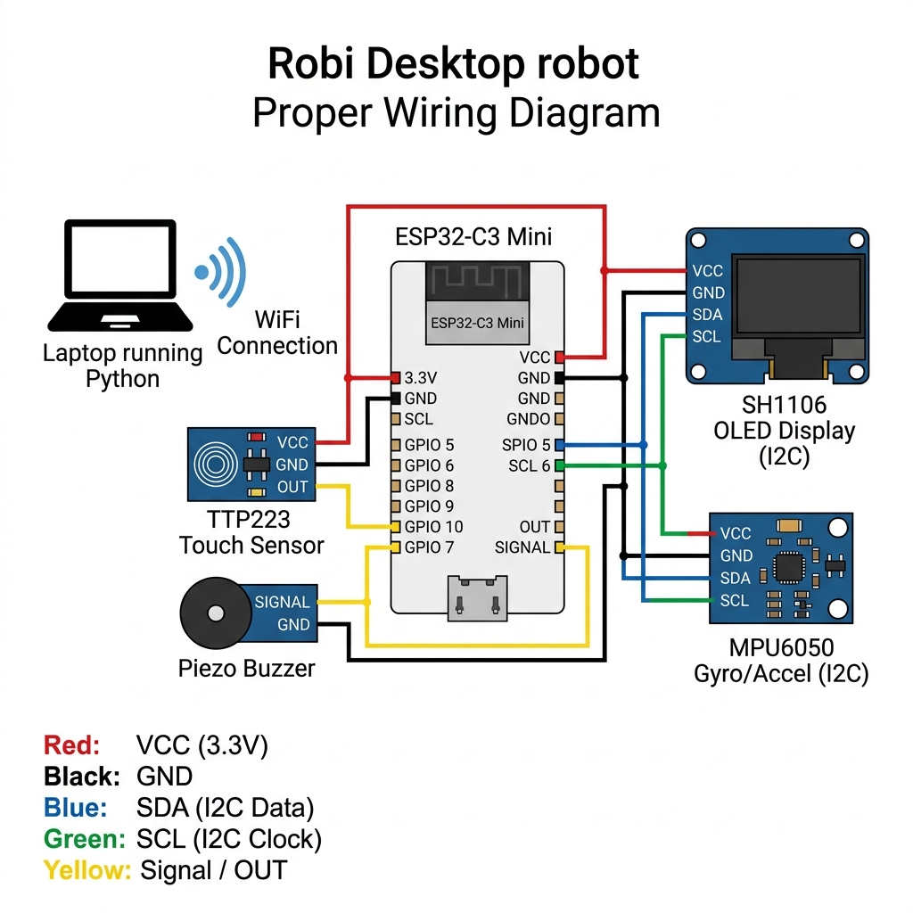

# 🤖 Robi — AI Desktop Companion Robot

Robi is an AI-powered desktop companion robot built with an **ESP32-C3 Mini** and a **Python backend**. It listens for voice commands via a wake word ("Hey Robi"), processes them through an AI model (OpenRouter), speaks the reply aloud, and displays expressive animated eyes on an OLED screen — complete with 35+ emotions, touch reactions, motion tracking, and a buzzer for sound effects.

---

## ✨ Features

- **Wake Word Activation** — Say *"Hey Robi"* followed by your question in a single sentence
- **AI Conversations** — Powered by OpenRouter (GPT-3.5 Turbo) with a playful robot personality
- **Animated Robot Eyes** — Smooth 60fps OLED animations with idle wandering, auto-blinking, and breathing
- **35+ Emotions** — Happy, sad, angry, curious, love, scared, giggle, glitch, peek-a-boo, and more
- **Touch Interactions** — Single tap → happy, double tap → excited, triple tap → mute toggle, long hold → sleep
- **Motion Tracking** — MPU6050 gyroscope makes eyes react to tilting and shaking
- **Sound Effects** — Unique buzzer sounds for every emotion and interaction
- **Text-to-Speech** — AI replies are spoken aloud via macOS `say` command
- **OLED Text Display** — Replies scroll across the OLED with a typewriter effect

---

## 🏗️ Architecture

```
┌─────────────────────┐         WiFi          ┌──────────────────────┐
│   Laptop (Python)   │◄────────────────────►│   ESP32-C3 Mini      │
│                     │                       │                      │
│  laptop_client.py   │   POST /display       │  OLED Eyes (SH1106)  │
│  - Whisper STT      │──────────────────────►│  Touch Sensor        │
│  - Wake word detect │                       │  MPU6050 Gyroscope   │
│  - macOS TTS        │   GET /latest_display │  Piezo Buzzer        │
│                     │◄──────────────────────│                      │
│  robi.py (Flask)    │                       └──────────────────────┘
│  - AI chat via      │
│    OpenRouter API   │
│  - Display queue    │
└─────────────────────┘
```

**How it works:**
1. `laptop_client.py` continuously listens on the MacBook microphone using Whisper
2. When it detects the wake phrase ("Hey Robi"), it extracts the question
3. The question is sent to the `robi.py` Flask server's `/chat` endpoint
4. The server calls the OpenRouter AI API and returns the reply
5. The reply is spoken aloud via macOS TTS and pushed to `/display` for the ESP32
6. The ESP32 polls `/latest_display` and shows the text on the OLED with eye animations

---

## 🔌 Circuit Diagram



### Pin Connections

| Component | Pin | ESP32-C3 GPIO |
|---|---|---|
| **SH1106 OLED** (I2C) | SDA | GPIO 5 |
| | SCL | GPIO 6 |
| | VCC | 3.3V |
| | GND | GND |
| **MPU6050 Gyro** (I2C) | SDA | GPIO 5 (shared) |
| | SCL | GPIO 6 (shared) |
| | VCC | 3.3V |
| | GND | GND |
| **TTP223 Touch** | OUT | GPIO 10 |
| | VCC | 3.3V |
| | GND | GND |
| **Piezo Buzzer** | Signal | GPIO 7 |
| | GND | GND |

> **Note:** The OLED and MPU6050 share the same I2C bus (GPIO 5/6). The OLED is at address `0x3C` and the MPU6050 is at address `0x68`.

---

## 📁 Project Structure

```
desktop-robo/
├── robi.py                  # Flask AI server (chat + display endpoints)
├── laptop_client.py         # Wake word listener + Whisper STT + TTS
├── start.sh                 # One-command launcher (opens both in Terminal)
├── requirements.txt         # Python dependencies
├── .env                     # API keys (OPENROUTER_API_KEY)
├── .gitignore
├── docs/
│   └── circuit_diagram.png  # Hardware wiring diagram
└── robi_esp32_pio/          # ESP32 PlatformIO firmware
    ├── platformio.ini       # Board config (ESP32-C3)
    └── src/
        └── main.cpp         # Full firmware: eyes, emotions, touch, WiFi
```

---

## 🚀 Setup

### Prerequisites

- **Hardware:** ESP32-C3 Mini, SH1106 128×64 OLED, MPU6050, TTP223 touch sensor, piezo buzzer
- **Software:** Python 3.10+, PlatformIO (or VS Code with PlatformIO extension), macOS (for TTS)

### 1. Clone & Install Python Dependencies

```bash
git clone https://github.com/abhinavkajeev/desktop-robo.git
cd desktop-robo
python3 -m venv .venv
source .venv/bin/activate
pip install -r requirements.txt
```

### 2. Configure Environment

Create a `.env` file in the project root:

```env
OPENROUTER_API_KEY=your_openrouter_api_key_here
```

### 3. Flash the ESP32

1. Open the `robi_esp32_pio/` folder in VS Code with PlatformIO
2. Update WiFi credentials in `src/main.cpp` (lines 29-31):
   ```cpp
   static const char* WIFI_SSID     = "YourWiFiName";
   static const char* WIFI_PASSWORD = "YourWiFiPassword";
   static const char* SERVER        = "http://YOUR_LAPTOP_IP:5001";
   ```
3. Connect the ESP32 via USB and click **Upload** in PlatformIO

### 4. Run Robi

```bash
bash start.sh
```

This opens two Terminal windows:
- **Terminal 1:** Flask server (`robi.py`) on port 5001
- **Terminal 2:** Wake word listener (`laptop_client.py`)

Or run them manually:

```bash
# Terminal 1
python robi.py

# Terminal 2
python laptop_client.py --server http://127.0.0.1:5001
```

---

## 🎮 Usage

| Action | What Happens |
|---|---|
| Say *"Hey Robi, what's the weather?"* | AI responds with voice + OLED text |
| **Single tap** touch sensor | Happy face + beep |
| **Double tap** touch sensor | Excited bounce + jingle |
| **Triple tap** touch sensor | Toggle buzzer mute |
| **Long hold** (2s) touch sensor | Sleep mode with Zzz animation |
| **Tilt / shake** the robot | Eyes track motion via gyroscope |
| *Wait idle* | Random emotions every 4-8 seconds |

---

## 🛠️ Tech Stack

| Layer | Technology |
|---|---|
| Microcontroller | ESP32-C3 Mini (Arduino + PlatformIO) |
| Display | SH1106 128×64 OLED via U8g2 library |
| Motion | MPU6050 6-axis IMU |
| AI Backend | OpenRouter API (GPT-3.5 Turbo) |
| Speech-to-Text | OpenAI Whisper (local, runs on laptop) |
| Text-to-Speech | macOS `say` command |
| Server | Flask (Python) |
| Communication | HTTP over WiFi |

---

## 📄 License

This project is open source. Feel free to build your own Robi!
